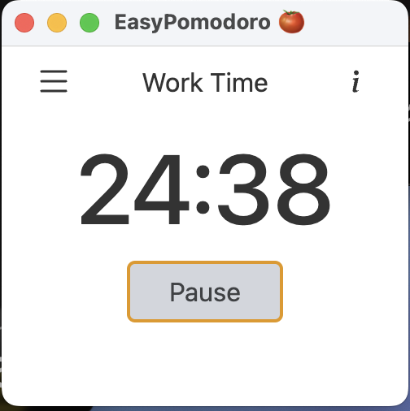

# 🍅 EasyPomodoro: Focus & get things done! 🤝

EasyPomodoro is a simple yet effective Pomodoro timer application built with Electron. It helps you stay focused and manage your time efficiently using the Pomodoro Technique. The app allows you to customize work, short break, and long break durations, track your completed Pomodoros, and provides a clean and intuitive user interface.

🚀 **Key Features**

*   **Customizable Timers:** Set your preferred durations for work, short breaks, and long breaks.
*   **Timer Management:** Start, pause, reset, and switch between work and break timers seamlessly.
*   **UI Updates:** Real-time updates to the timer display, information title, and button text.
*   **Settings Persistence:** Your timer settings are saved in `localStorage` for a consistent experience.
*   **Options Modal:** Easily adjust timer durations through a user-friendly options modal.
*   **Information Modal:** Access helpful information about the Pomodoro Technique.
*   **Cross-Platform:** Built with Electron, it runs on Windows, macOS, and Linux.

🛠️ **Tech Stack**

*   **Frontend:** HTML, CSS, JavaScript
*   **Backend:** Electron
*   **Runtime:** Node.js
*   **Build Tool:** npm
*   **Development Tool:** nodemon
*   **Storage:** `localStorage` (browser-based)

📦 **Getting Started**

### Prerequisites

*   Node.js and npm installed on your machine.  You can download them from [nodejs.org](https://nodejs.org/).

### Installation

1.  Clone the repository:
    ```bash
    git clone <repository_url>
    cd easypomodoro
    ```

2.  Install the dependencies:
    ```bash
    npm install
    ```

### Running Locally

1.  Start the application:
    ```bash
    npm start
    ```

    Or, to automatically restart the application on file changes (for development):
    ```bash
    npm run watch
    ```

📂 **Project Structure**

```
easypomodoro/
├── index.js          # Main entry point for the Electron application
├── app.js            # JavaScript logic for the Pomodoro timer
├── index.html        # HTML structure for the user interface
├── package.json      # Project metadata and dependencies
├── node_modules/     # (Automatically generated) Project dependencies
└── ...               # Other project files (e.g., CSS, images)
```

📸 **Screenshots**



🤝 **Contributing**

Contributions are welcome! Please feel free to submit pull requests or open issues to suggest improvements or report bugs.

📝 **License**

[Specify the License] (e.g., MIT License)

📬 **Contact**

Bruno Rodríguez - bruno08rodriguez@gmail.com - [bruno.com.es](https://bruno.com.es)

💖 **Thanks**

Thank you for checking out EasyPomodoro! We hope it helps you stay focused and productive.
